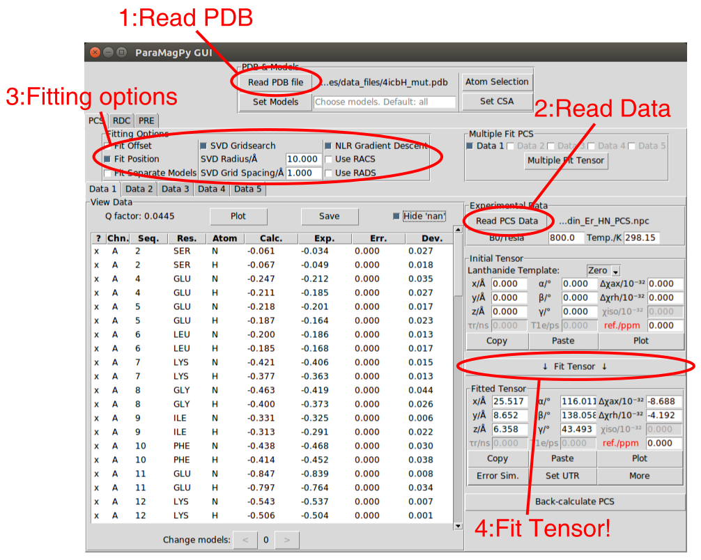

.. _paramagpy_gui:

Graphic User Interface (GUI)
============================

Paramagpy is equipped with a GUI which is cross-platform and contains most of the functionality of the scripted module. This gives a rapid way for new users to fit and compare PCS, RDC and PRE effects.

The GUI can be launched by running ``paramagpy.gui.run()`` within a python environment, or by requesting a prebuilt executable.

